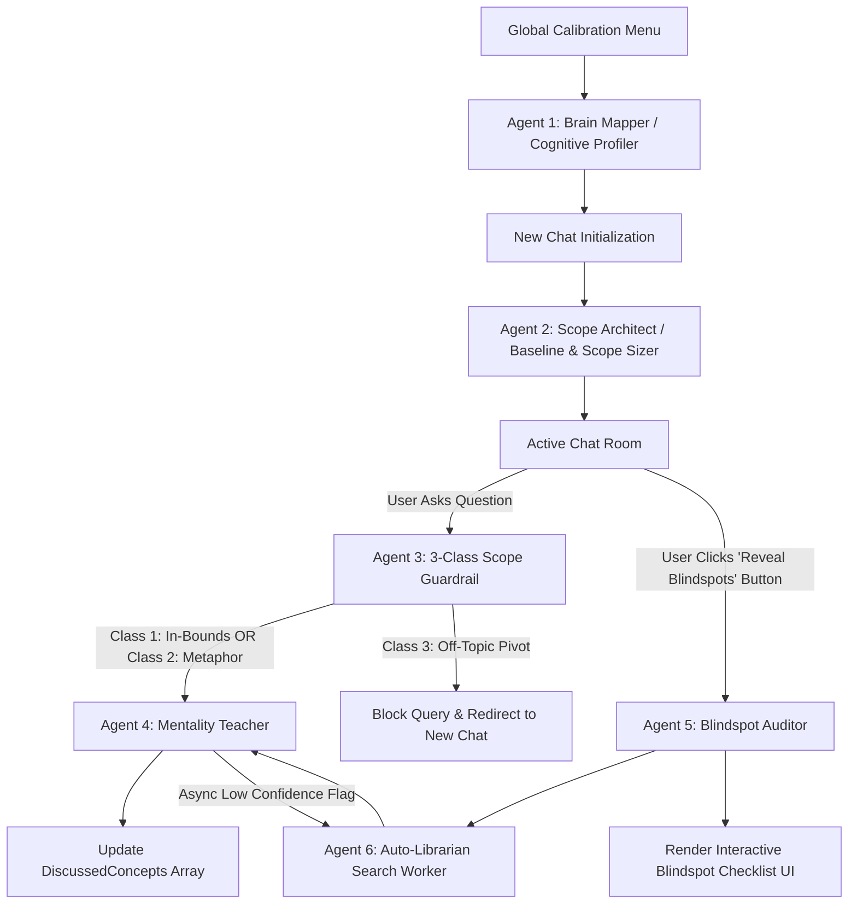

# Syntapse: Adaptive Single-Topic Second-Brain Engine
> **Master Technical Blueprint & Agentic System Specification**

---

## 📌 Executive Summary & Core Philosophy

**Syntapse** is an agentic learning platform designed to solve the two biggest flaws in self-directed learning and current AI chatbots:

1. **The Epistemic Blindspot (The Dunning-Kruger Trap):** Standard AI chatbots only answer what you ask. Because you don't know what you don't know, you walk away with superficial confidence while missing 40% of the core concepts.
2. **One-Size-Fits-All Explanations:** Traditional tutorials and generic LLMs explain concepts using textbook jargon, ignoring how an individual's brain naturally processes information (whether through mechanical analogies, visual top-down blueprints, or code-first first-principles).

Syntapse builds a persistent **Cognitive Profile** of the user's mental learning style, locks conversations into **Single-Topic Isolated Chambers**, dynamically enriches knowledge via deduplicated background searches, and features an on-demand **Blindspot Audit Engine** that explicitly exposes missing concepts on a manual button click.

---

## 💡 The Core Problem vs. The Syntapse Solution

| Real-World Problem | Standard AI Failure | The Syntapse Solution |
| :--- | :--- | :--- |
| **Passive Knowledge Gaps** | Answers *only* what you ask, leaving huge hidden blindspots. | **On-Demand "Reveal Blindspots" Button:** Diffs chat history against domain ground-truth to highlight missing subtopics. |
| **Generic Textbook Style** | Uses browser-default jargon; forgets custom prompts after 15 turns. | **Global Cognitive Profiling + Dual-Layer Teaching:** Explains via user's preferred analogies + 2-sentence technical reality anchor. |
| **Context & Scope Drift** | Answers any off-topic query, polluting thread context and causing memory loss. | **3-Class Scope Guardrail Agent:** Blocks topic pivots and keeps the chat room locked to 100% topic focus. |
| **Search Latency & Duplicates** | Slow live searches; dumps repetitive Bing links into context. | **Async Auto-Librarian:** Searches in the background, deduplicates facts (>0.85 cosine score), and updates context cleanly. |

---

## 🔄 The Layman Pipeline (Phase by Phase)

* **Phase 1: Brain Profiling (Global Calibration)**
  * *Line 1:* You write a short paragraph about a topic you already know well to show how your brain works.
  * *Line 2:* The system analyzes your style (analogies, top-down vs. code-first, tone) and saves your permanent `CognitiveProfile`.

* **Phase 2: Topic Room Creation (Scope Lock)**
  * *Line 1:* You start a new chat by typing the exact topic you want to learn and what you already know about it (or click 'Beginner Skip').
  * *Line 2:* The system narrows down huge topics (like turning "Physics" into "Newton's Laws") and locks the chat room for 100% focus.

* **Phase 3: Smart Guardrail (The Boundary Bouncer)**
  * *Line 1:* Before your question reaches the AI teacher, a guardrail agent checks if your input is related to the chat's topic.
  * *Line 2:* It allows helpful metaphors (like comparing databases to libraries), but blocks off-topic questions and prompts you to open a new chat.

* **Phase 4: Tailored Teaching (Dual-Layered Response)**
  * *Line 1:* The AI teacher answers your question using your favorite analogies so the concept immediately clicks.
  * *Line 2:* Right below the analogy, it gives a 2-sentence precise technical summary so you learn actual facts without over-simplification.

* **Phase 5: Background Knowledge Search (The Auto-Librarian)**
  * *Line 1:* If you ask a complex question, a background worker instantly searches Google for accurate, up-to-date facts.
  * *Line 2:* It removes duplicate information (>0.85 similarity score) and saves fresh facts into your topic room without making you wait.

* **Phase 6: The "Blindspot Audit" (Reveal What You Missed)**
  * *Line 1:* You click a button called "Reveal Blindspots" whenever you want to check your true progress on the topic.
  * *Line 2:* The system compares your chat history against a complete topic guide, finds the top 3 things you forgot to ask about, and shows them as a simple checklist.

---

## 🤖 The 6 Core Agents & Responsibilities



### 1. Agent 1: Decoupled Cognitive Profiling Pipeline (*"Brain Mapper"*)
* **Trigger:** User Calibration Menu & Target Topic Selection.
* **Architecture:** Decoupled 3-Sub-Agent Pipeline:
  * **Agent 1A: Cognitive Mapper:** Performs pure forensic linguistic analysis on the user's text to extract structural mechanics (`CognitiveMechanics` JSON). Zero predictions, zero domain judgments.
  * **Agent 1B: Domain Grounding Agent:** Executed when a target topic $T$ is selected to map user mechanics against $T$'s canonical structure, producing evidence-traced friction predictions (`GroundedProfile` JSON).
  * **Agent 1C: Translation Layer:** Compiles mechanics and friction maps into actionable system prompt overrides, pacing rules, and taboo metaphors for Agent 4 (`TutorDirective` JSON).
* **Output:** Clean `CognitiveMechanics` + `GroundedProfile` + `TutorDirective` JSON payloads. Includes a 3-question diagnostic fallback if input text is sparse.

### 2. Agent 2: Baseline & Scope Sizer (*"Scope Architect"*)
* **Trigger:** New Chat Session creation.
* **Role:** Sanitizes topic scope (narrows broad topics like *"Computer Science"* to *"Data Structures"*). Processes initial user baseline or handles the 'Beginner Skip' route by generating a 5-step starter curriculum.

### 3. Agent 3: 3-Class Scope Guardrail (*"Boundary Bouncer"*)
* **Trigger:** Pre-execution check on every user prompt.
* **Role:** Enforces topic boundaries using 3-class intent classification:
  * *Class 1 (In-Bounds):* Direct topic queries $\rightarrow$ Pass.
  * *Class 2 (Metaphor Bridge):* Cross-domain metaphors $\rightarrow$ Allow.
  * *Class 3 (Topic Pivot):* Unrelated topics $\rightarrow$ Block & prompt user to open a new chat room.

### 4. Agent 4: Mentality Teacher (*"Dual-Layer Explainer"*)
* **Trigger:** Approved user prompt in chat.
* **Role:** Synthesizes responses using the user's `CognitiveProfile` in a Dual-Layer Format:
  * *Layer 1 (Analogy Bridge):* Concepts mapped to user's native mental domain.
  * *Layer 2 (Technical Reality Anchor):* 2-sentence precise technical fact.

### 5. Agent 5: Blindspot Auditor (*"Gap Detector"*)
* **Trigger:** Manual click on UI button **"Reveal Blindspots"**.
* **Role:** Diffs session `DiscussedConcepts` against an LLM Ground-Truth Topic Blueprint. Identifies top 3 unmentioned critical subtopics and passes them to Agent 6 for enrichment.

### 6. Agent 6: Auto-Librarian (*"Deduplicated Web Enricher"*)
* **Trigger:** Async low-confidence flag or Auditor request.
* **Role:** Searches Google/Tavily API. Runs vector similarity scoring (>0.85 cosine distance) to **merge/discard duplicate facts**, updating `ChatState.additional_info` cleanly.

---

## ⚡ Agent Lifecycle Hooks & Event Loophole Solutions

To ensure system reliability in production, Syntapse implements 5 strict **Lifecycle Event Hooks**:

```
[ Event: user_message_received ] ──► (Hook: on_pre_guardrail_timeout) ──► 1.5s Fallback to Regex Classifier
                                            │
[ Event: assistant_response_start ] ─► (Hook: on_ui_stream_lock) ──────► Disable "Reveal Blindspots" UI Button
                                            │
[ Event: assistant_response_emit ] ──► (Hook: on_async_queue_lock) ─────► Prevent Search Race Conditions
                                            │
[ Event: session_state_update ] ────► (Hook: on_checkpoint_save) ─────► Atomic DB State Persistence
                                            │
[ Event: profile_mutation ] ────────► (Hook: on_profile_validation) ──► EMA Dampening & Jailbreak Filter
```

1. **Pre-Guardrail Timeout Hook (`on_pre_guardrail_timeout`):** If the Guardrail LLM latency exceeds 1.5 seconds, it automatically falls back to a fast local semantic embedding classifier to prevent chat lag.
2. **UI Stream Lock Hook (`on_ui_stream_lock`):** Disables the "Reveal Blindspots" UI button while a response is actively streaming, preventing state corruption from rapid button clicks.
3. **Async Search Queue Lock (`on_async_queue_lock`):** Employs an `AsyncLock(chat_id)` around `ChatState.additional_info` to prevent race conditions when multiple fast queries trigger background searches.
4. **Atomic Checkpoint Hook (`on_checkpoint_save`):** Persists session state to DB immediately after scope sanitization so page reloads never lose the topic scope lock.
5. **Profile Mutation Validation Hook (`on_profile_validation`):** Applies Exponential Moving Average (EMA) dampening and Pydantic validation to block adversarial prompt injection attempts aimed at corrupting `CognitiveProfile`.

---

## 🛠️ Pydantic Data Schemas & State Objects

### 1. `CognitiveProfile`
```python
from pydantic import BaseModel
from typing import Optional

class CognitiveProfile(BaseModel):
    user_id: str
    metaphor_domain: str          # e.g., "mechanical_engineering", "nature", "code"
    abstraction_preference: str  # e.g., "top_down", "first_principles"
    format_preference: str       # e.g., "bullet_points_with_code"
    pacing: str                  # e.g., "micro_steps"
    tone: str                    # e.g., "socratic_mentor"
    quality_verified: bool = True
```

### 2. `ChatState`
```python
from pydantic import BaseModel
from typing import List, Dict, Any

class ScrapedInfoSnippet(BaseModel):
    source_url: str
    snippet: str
    similarity_score: float

class BlindspotItem(BaseModel):
    concept: str
    status: str  # "UNSEEN", "HIGHLIGHTED", "UNDERSTOOD"

class ChatState(BaseModel):
    chat_id: str
    topic_name: str
    scope_sanitized: bool = True
    is_beginner_skip: bool = False
    user_baseline: str
    discussed_concepts: List[str] = []
    additional_info: List[ScrapedInfoSnippet] = []
    blindspot_checklist: List[BlindspotItem] = []
    rolling_summary: str = ""
```

---

## 🔬 Master Matrix of 10 Solved Contradictions & Loopholes

| # | Potential Flaw / Contradiction | Impact | Syntapse Architectural Fix |
|---|---|---|---|
| **1** | Double Onboarding Friction | User fatigue from typing preferences every chat | Decouple Global Profile (done once) from Per-Chat Baseline. |
| **2** | Lazy Calibration Input | Corrupted/hallucinated user profile | Quality Assessment Gate falling back to a 3-Question Diagnostic. |
| **3** | Beginner Skip Path Search Crisis | No initial baseline to trigger targeted web search | Trigger a Curriculum Generator Agent to build a 5-step roadmap. |
| **4** | Guardrail False Positives on Metaphors | User blocked from using metaphors (e.g. books for DBs) | 3-Class Guardrail System (In-Bounds, Metaphor Bridge, Pivot). |
| **5** | Over-Ambitious Topic Scope | Broad topics ("Physics") break guardrails & blindspots | Scope Sizer Agent intercepts broad topics and narrows focus. |
| **6** | Over-Simplification Trap | Bad analogies cause factually incorrect understanding | Dual-Layered Explanations (Metaphor Bridge + Technical Anchor). |
| **7** | Live Search Latency Spike (6-10s) | Slow chat turn response times | Async Background Worker fetching search data for future turns. |
| **8** | Blindspot Button Spam Loop | Redundant web searches on repeated button clicks | Blindspot Checklist State Machine tracking item completion. |
| **9** | Volatile Profile Drift | Profile corrupted by one hasty user prompt | Exponential Moving Average dampening (requires 3-4 signals). |
| **10**| Long Chat Context Pollution | LLM loses profile directives ("Lost in the Middle") | 6-Turn Rolling Buffer + Compressed `Topic Summary Memory`. |

---

## 📁 Repository Structure (`V:\PROJECTS\project_agents`)

```
V:\PROJECTS\project_agents\
├── app/
│   ├── agents/
│   │   ├── profiler.py        # Agent 1: Global Cognitive Profiler
│   │   ├── scope_sizer.py     # Agent 2: Scope Architect & Baseline Analyzer
│   │   ├── guardrail.py       # Agent 3: 3-Class Scope Guardrail
│   │   ├── responder.py       # Agent 4: Mentality Teacher Agent
│   │   ├── auditor.py         # Agent 5: Blindspot Auditor Agent
│   │   └── librarian.py       # Agent 6: Auto-Librarian Search Worker
│   ├── storage/
│   │   └── memory_store.py    # Persistent ChatState & CognitiveProfile store
│   └── schemas.py             # Pydantic data models & state vectors
├── static/
│   ├── script.js              # UI interaction logic (Calibration, Chat, Blindspot Button)
│   └── styles.css             # Glassmorphic dark-mode UI styling
├── templates/
│   └── index.html             # Single-Page App (SPA) layout
├── LAYMAN_PROPOSAL.md         # 2-line layman pipeline summary
├── PROPOSAL_AND_PIPELINE.md   # 4-page project whitepaper
├── README.md                  # Master System Blueprint & Agent Specs (This File)
└── run.py                     # Entry point for backend server (FastAPI/Flask)
```

---

## 🤖 Instructions for AI Coding Assistants (Antigravity Directive)

When implementing or extending code in this repository:
1. **Respect State Schemas:** Always route agent data through the Pydantic models in `app/schemas.py`.
2. **Strict Guardrail Execution:** Never bypass `Agent 3 (Guardrail)` before invoking `Agent 4 (Responder)`.
3. **Dual-Layer Enforcement:** System prompts for `Agent 4` MUST enforce Layer 1 (Metaphor) followed by Layer 2 (Technical Reality Anchor).
4. **Async Non-Blocking Search:** Search calls in `Agent 6` must be non-blocking to preserve <2s chat response streaming.
5. **Lifecycle Hooks Integration:** Ensure all 5 event hooks (`on_pre_guardrail_timeout`, `on_ui_stream_lock`, `on_async_queue_lock`, `on_checkpoint_save`, `on_profile_validation`) are active in the event loop.
