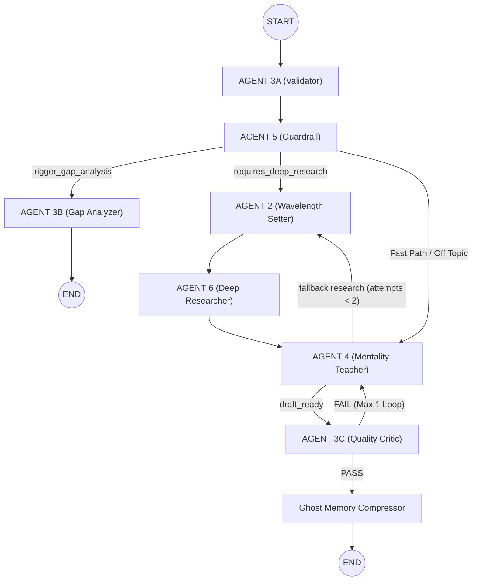

# Syntapse Multi-Agent Learning System — Complete Architecture README & Learner Guide

A learner-friendly, complete walkthrough of how Cogniflow's adaptive tutoring pipeline actually works — from Cognitive Calibration and Chamber Initialization to LangGraph orchestration, Reducer layer execution, and State Persistence. No code — just concepts, workflows, data contracts, and why each piece exists.

---

## 1. The Big Picture — What Is Syntapse?

### The Core Problem It Solves

Most AI tutors give everyone the same static answer. If you already understand the basics, you get bored. If you're struggling, you get lost. The system doesn't adapt to *how you think*.

Syntapse solves this by doing something fundamentally different: **it reverse-engineers how you reason first**, then tailors every explanation, analogy, and follow-up question to match your personal cognitive profile.

---

## 2. Chamber Creation, Topic Selection & Optional Content Flow

Before any chat turn occurs, the user creates a learning chamber in the UI by selecting a topic name and optionally pasting reference materials (such as notes, PDFs, or technical docs).

```
┌────────────────────────────────────────────────────────────────────────┐
│ UI Chamber Initializer                                                 │
│  • Topic Name: "Linux Kernel eBPF & XDP Packet Processing Pipeline"     │
│  • Optional Content: (Custom documentation, code snippets, notes)      │
└───────────────────────────────────┬────────────────────────────────────┘
                                    │
                                    ▼
┌────────────────────────────────────────────────────────────────────────┐
│ POST /session/start API Request                                        │
│  Sends: { session_id, topic_name, user_context, cognitive_profile }   │
└───────────────────────────────────┬────────────────────────────────────┘
                                    │
                                    ▼
┌────────────────────────────────────────────────────────────────────────┐
│ LangGraph State Initialization (SyntapseChamberState)                  │
│  • topic_name ──► First-Class State Field (Persisted in SQLite)        │
│  • user_topic_context ──► First-Class Grounding Memory Payload          │
└───────────────────────────────────┬────────────────────────────────────┘
                                    │
         ┌──────────────────────────┴──────────────────────────┐
         ▼                                                     ▼
┌──────────────────────────────────┐        ┌──────────────────────────────────┐
│ AGENT 5 (Scope Guardrail)        │        │ AGENT 4 (Mentality Teacher)      │
│ Evaluates chat inputs against    │        │ Injects optional user_context to │
│ topic_name to block off-topic    │        │ ground explanations directly in  │
│ drift or trigger deep research.  │        │ uploaded reference facts.        │
└──────────────────────────────────┘        └──────────────────────────────────┘
```

### Explanations & Off-Topic Handling Mechanics:

1. **How `topic_name` Is Used**:
   - `topic_name` is stored as a persistent string in `SyntapseChamberState`.
   - **AGENT 5 (Scope Guardrail)** evaluates every user chat input against `topic_name`.

2. **What Happens If a Message Is Off-Topic?**:
   - If a user asks an off-topic question (for example, asking for Kyoto tourism spots inside an eBPF technical chamber), AGENT 5 flags `is_off_topic = True`.
   - The conditional router `route_from_guardrail` sends the query directly to **AGENT 4 (Mentality Teacher)**.
   - AGENT 4 detects `is_off_topic == True` and returns a polite **Scope Guardrail Alert**:
     > *"🚨 Scope Guardrail Alert: Your question has drifted away from our chamber topic: Linux Kernel eBPF & XDP Packet Processing Pipeline. Please open a new learning chamber to discuss this!"*
   - **Safety Reset**: AGENT 4 automatically resets `is_off_topic = False` in state so the user is not trapped in an off-topic loop on their next turn.

3. **How `user_topic_context` (Optional Content) Is Used**:
   - `user_topic_context` stores any reference text uploaded during chamber creation.
   - It is passed directly into **AGENT 4 (Mentality Teacher)** as grounding memory. When AGENT 4 generates an explanation, it prioritizes your uploaded reference facts, ensuring explanations remain aligned with your specific notes without inventing outside concepts.

4. **How Cognitive Hypotheses Are Seeded (`compile_raw_profile`)**:
   - During `POST /session/start`, the backend executes `compile_raw_profile(effective_profile)` from `backend/cognitive/profile_compiler.py`.
   - This translates Agent 1's extracted profile into active Bayesian hypotheses (`H_CAUSAL_xxx`, `H_ABSTR_xxx`, `H_KNOW_xxx`) and seeds them into `active_cognitive_hypotheses` in `SyntapseChamberState`.
   - This empowers **AGENT 3A (Cognitive Validator)** to track and update Bayesian confidence weights when you answer Socratic Probes.

---

## 3. High-Level System Journey

1. **Phase 1: Onboarding Calibration (AGENT 1 - Mapper)** — User submits a short essay. Agent 1 extracts the **Cognitive Footprint** (epistemic style, causal reasoning structure, abstraction ladder movement, friction points).
2. **Phase 2: Chamber Setup (`/session/start`)** — User inputs a `topic_name` and optional `user_topic_context`. LangGraph initializes a session bound to SQLite checkpointer (`syntapse_sessions.db`).
3. **Phase 3: Active Chat Turn Pipeline** — User submits a question/answer (`POST /chat`). The query flows sequentially through specialized AI agents orchestrated by **LangGraph**.
4. **Phase 4: Socratic Probe & Cognitive Feedback** — **AGENT 3A (Cognitive Validator)** evaluates probe responses against expected evidence to track mastery and update Bayesian cognitive profile weights.
5. **Phase 5: Knowledge Gap Diagnostics** — On demand (`POST /gap_analysis`), **AGENT 3B (Knowledge Gap Analyzer)** evaluates transcript and probe failure history to generate 1-click diagnostic cards.

---

## 4. Dual Turn Lifecycle: Standard Query Flow vs. Probe Answer Flow

The system operates in **two distinct conversation modes** depending on whether the user is asking a fresh question or answering a Socratic Probe:

### Mode A: Standard Learning Query Flow (Fresh Technical Question)
When you ask a new technical question (e.g. *"How does XDP bypass the Linux network stack?"*):

```
User Asks Fresh Question
         │
         ▼
┌─────────────────────────┐
│ AGENT 3A                │  ← Sees NO active probe awaiting validation.
│ Cognitive Validator     │     Exits cleanly (0 token overhead).
└────────────┬────────────┘
             │
             ▼
┌─────────────────────────┐
│ AGENT 5                 │  ← Evaluates question against chamber topic.
│ Scope Guardrail         │     Flips requires_deep_research = True.
└────────────┬────────────┘
             │
             ▼
┌─────────────────────────┐
│ AGENT 2                 │  ← Sets search wavelength (MICRO/MESO/MACRO)
│ Wavelength Setter       │     and WRITES structured search queries.
└────────────┬────────────┘
             │
             ▼
┌─────────────────────────┐
│ AGENT 6                 │  ← Executes Tavily web search using AGENT 2's queries.
│ Deep Researcher         │     Dumps verified facts into research_catalog.
└────────────┬────────────┘
             │
             ▼
┌─────────────────────────┐
│ AGENT 4                 │  ← Synthesizes personalized explanation matching Cognitive DNA.
│ Mentality Teacher       │     Attaches a new Socratic Probe (last_teacher_probe).
└────────────┬────────────┘
             │
             ▼
┌─────────────────────────┐
│ Ghost Memory            │  ← Compresses response into 1KB ghost record.
│ Compressor Node         │     Saves checkpoint to SQLite -> END.
└─────────────────────────┘
```

---

### Mode B: Probe Answer & Cognitive Feedback Flow (User Answers Probe)
When you answer the teacher's previous Socratic Probe:

```
User Answers Socratic Probe
         │
         ▼
┌─────────────────────────┐
│ AGENT 3A                │  ← Sees active last_teacher_probe. Grades response quality,
│ Cognitive Validator     │     updates Bayesian profile weights, and logs CognitiveEvent.
└────────────┬────────────┘
             │
             ▼
┌─────────────────────────┐
│ AGENT 5                 │  ← Checks topic safety; routes directly to Teacher
│ Scope Guardrail         │     (no deep web research needed for probe answers).
└────────────┬────────────┘
             │
             ▼
┌─────────────────────────┐
│ AGENT 4                 │  ← Reads updated Cognitive Profile weights.
│ Mentality Teacher       │     Generates next Socratic explanation + new probe.
└────────────┬────────────┘
             │
             ▼
┌─────────────────────────┐
│ Ghost Memory            │  ← Compresses response into 1KB ghost record.
│ Compressor Node         │     Saves checkpoint to SQLite -> END.
└─────────────────────────┘
```

---

## 4.1 Conditional Logic Flow Diagram & Phase Explanations

### System Control Flowchart

```
                  ┌─────────────────────────────────────┐
                  │ SETUP & CALIBRATION PHASE           │
                  │         (AGENT 1 Mapper)            │
                  └──────────────────┬──────────────────┘
                                     │
                                     ▼
                  ┌─────────────────────────────────────┐
                  │ PROBE VALIDATION PHASE              │
                  │         (AGENT 3A Validator)        │
                  └──────────────────┬──────────────────┘
                                     │
                                     ▼
                  ┌─────────────────────────────────────┐
                  │ INTENT & SCOPE ROUTING PHASE        │
                  │        (AGENT 5 Guardrail)          │
                  └──────────────────┬──────────────────┘
                                     │
      ┌──────────────────────────────┼──────────────────────────────┐
      │ (Gap Analysis Request)       │ (Needs Deep Search)          │ (Fast Path / Probe Answer)
      ▼                              ▼                              │
┌──────────────┐               ┌──────────────┐                     │
│ AGENT 3B     │               │ AGENT 2      │                     │
│ Gap Analyzer │               │ Wavelength   │                     │
└──────┬───────┘               └──────┬───────┘                     │
       │                              │                             │
       │                              ▼                             │
       │                       ┌──────────────┐                     │
       │                       │ AGENT 6      │                     │
       │                       │ Researcher   │                     │
       │                       └──────┬───────┘                     │
       │                              │                             │
       │                              └──────────────┬──────────────┘
       │                                             │
       │                                             ▼
       │                                      ┌──────────────┐
       │                                      │ AGENT 4      │
       │                                      │ Teacher      │
       │                                      └──────┬───────┘
       │                                             │
       │                                (Fallback?)  ├─► Loop back to AGENT 2 (Max 2)
       │                                             │
       │                                             ▼
       │                                      ┌──────────────┐
       │                                      │ AGENT 3C     │
       │                                      │ Critic       │
       │                                      └──────┬───────┘
       │                                             │
       │                                 ┌───────────┴───────────┐
       │                             (FAIL)                   (PASS)
       │                                 │                       │
       │                                 ▼                       ▼
       │                          ┌─────────────┐         ┌─────────────┐
       │                          │ Loop back   │         │ Ghost       │
       │                          │ to Agent 4  │         │ Memory      │
       │                          │ (Max-1 Pass)│         │ Compressor  │
       │                          └─────────────┘         └──────┬──────┘
       │                                                         │
       └─────────────────────────────────────────────────────────┤
                                                                 │
                                                                 ▼
                                                              [ END ]
```

---

### Phase-by-Phase Conditional Decision Logic & Explanations

#### 📶 Setup & Calibration Phase (AGENT 1)

* **Conditional Decision Flow**:
  * `IF` `cognitive_profile.json` exists on disk ──► Hydrate existing profile into memory state.
  * `ELSE` ──► Require user essay calibration ──► Run **AGENT 1 (Mapper)** ──► Save baseline `cognitive_profile.json`.

* **Intuitive Explanation**:
  Before any tutoring occurs, the system must understand your baseline reasoning style. Agent 1 extracts your **Cognitive Footprint** from an onboarding writing sample. If a profile already exists on disk, the system instantly reloads it without re-running calibration.

---

#### 📶 Probe Validation Phase (START ──► AGENT 3A)

* **Conditional Decision Flow**:
  * `IF` `last_teacher_probe == null` OR `probe_type != "validation"` ──► Bypass validation cleanly with 0 token cost.
  * `ELSE IF` user text classified as `NOT_ANSWERING_PROBE` ──► Preserve profile weights ──► Pass message directly to Guardrail.
  * `ELSE IF` user text classified as `ANSWERED` ──► Grade reasoning ──► Update Bayesian weights ($\text{Confidence} = \frac{\text{Support}}{\text{Support} + \text{Contradiction} + 1.0}$) ──► Log permanent `CognitiveEvent` record ──► Reset `last_teacher_probe = None`.

* **Intuitive Explanation**:
  Every chat turn enters Agent 3A first. If you answered a previous Socratic Probe, Agent 3A grades your reasoning quality and updates your profile's Bayesian confidence weights. If you asked a fresh question instead of answering the probe, Agent 3A bypasses grading with 0 token cost and lets your question pass immediately to the Guardrail.

---

#### 📶 Scope & Intent Routing Phase (AGENT 5 ──► Router 1)

* **Conditional Decision Flow**:
  * `IF` `trigger_gap_analysis == True` ──► Route to **AGENT 3B (Knowledge Gap Analyzer)**.
  * `ELSE IF` `is_off_topic == True` OR `is_greeting == True` OR `is_meta == True` ──► Route directly to **AGENT 4 (Mentality Teacher)** [Fast Path Bypass].
  * `ELSE IF` `requires_deep_research == True` ──► Route to **AGENT 2 (Wavelength Setter)**.
  * `ELSE` (Default Fallback) ──► Route to **AGENT 4 (Mentality Teacher)**.

* **Intuitive Explanation**:
  Agent 5 acts as a high-level Traffic Controller. It evaluates whether your message is off-topic, a simple greeting, a request for gap analysis, or a technical question. If web research is required, it flips `requires_deep_research = True` and routes to Agent 2; if off-topic or a greeting, it skips web search entirely and sends your message directly to the Teacher.

---

#### 📶 Research Strategy & Execution Phase (AGENT 2 ──► AGENT 6)

* **Conditional Decision Flow**:
  * **AGENT 2 (Wavelength Setter)**:
    * Determine Zoom Level (`MICRO`, `MESO`, `MACRO`).
    * Write `agent_6_queries` specifying `search_depth`, `include_domains`, and `exclude_domains`.
  * **AGENT 6 (Deep Researcher)**:
    * `IF` search queries present ──► Execute Tavily API search ──► Append facts to `research_catalog` ──► Increment `research_attempts +1` ──► Route to **AGENT 4**.

* **Intuitive Explanation**:
  Agent 2 designs the search strategy by selecting a microscope zoom level (`MICRO` for code APIs, `MESO` for component interactions, `MACRO` for overviews) and writing domain-filtered search queries. Agent 6 takes those exact queries, calls the Tavily API, and dumps verified technical facts into `research_catalog`.

---

#### 📶 Pedagogical Synthesis & Quality Audit Phase (AGENT 4 ──► AGENT 3C ──► Router 3)

* **Conditional Decision Flow**:
  * **AGENT 4 (Mentality Teacher)**:
    * `IF` `is_off_topic == True` ──► Return Scope Guardrail Alert & reset `is_off_topic = False`.
    * `ELSE` ──► Synthesize personalized response matching Cognitive DNA ──► Set new `last_teacher_probe`.
  * **Router 2 (`route_from_teacher`)**:
    * `IF` missing technical details AND `research_attempts < 2` ──► Loop back to **AGENT 2 (Wavelength Setter)** for deeper search.
    * `ELSE` ──► Route to **AGENT 3C (Quality Critic)**.
  * **AGENT 3C (Quality Critic)**:
    * Audits draft for completeness, anti-fluff, fact grounding, and concrete-anchor profile alignment using NVIDIA Llama 3.1 8B.
  * **Router 3 (`route_from_quality_check`)**:
    * `IF` `quality_critique != null` AND `quality_regeneration_count <= 1` ──► Loop directly back to **AGENT 4** for redraft pass.
    * `ELSE` (Approved OR `regeneration_count >= 1`) ──► Route to **Ghost Memory Compressor Utility Node**.

* **Intuitive Explanation**:
  Agent 4 crafts a Socratic explanation tailored to your Cognitive Profile using facts from `research_catalog` and uploaded reference notes (`user_topic_context`). Agent 3C audits the Teacher's draft. If the draft has conversational fluff, missing requested code, or lacks a concrete anchor, Agent 3C rejects it and loops directly back to Agent 4 with actionable critique (Max-1 pass). Once approved, the graph hands off to Memory Compression.

---

#### 📶 Compression & Diagnostics Finalization Phase (Compressor & AGENT 3B)

* **Conditional Decision Flow**:
  * **Ghost Memory Compressor Node**:
    * Compress response into 1KB ghost record ──► Append to `teacher_memory` ──► Save SQLite Checkpoint ──► **[END]**.
  * **AGENT 3B (Knowledge Gap Analyzer)**:
    * `IF` `user_messages < 2` turns ──► Return prompt asking user to ask at least 2 questions first.
    * `ELSE` ──► Analyze exploration path + `cognitive_events` + `teacher_memory` ──► Overwrite `last_gap_analysis` dict (`diagnostic_summary` & `suggestions` list) ──► **[END]**.

* **Intuitive Explanation**:
  For standard chat turns, the Compressor Node shrinks the teacher's explanation into a 1KB semantic ghost record so context limits are never breached, then saves graph state to SQLite. For Gap Analysis requests, Agent 3B compares your exploration path against the full topic map to generate 1-click exploration cards.

---

### 4.1.1 How Conditional Edges Choose Execution Paths (Switch Router Logic)

LangGraph conditional edges operate like a **`switch` statement** or `if/elif/else` router in code. They do not make arbitrary choices; instead, prior nodes set boolean flags in `SyntapseChamberState`, and the router functions inspect those flags to select the next node:

#### 1. Guardrail Router: `route_from_guardrail(state)` (Evaluated After AGENT 5)

This function evaluates 4 state conditions in priority order:

1. **Condition 1 (FAB Gap Analysis Trigger)**:
   * **State Checked**: `state.get("trigger_gap_analysis") == True`
   * **Target Path**: Routes to **AGENT 3B (Knowledge Gap Analyzer)** ──► `END`.
   * **Why**: The user clicked the Gap Analysis Floating Action Button (FAB) in the UI.

2. **Condition 2 (Scope Guardrail Rejection)**:
   * **State Checked**: `state.get("is_off_topic") == True`
   * **Target Path**: Routes directly to **AGENT 4 (Mentality Teacher)**.
   * **Why**: User asked a question outside `topic_name`. AGENT 4 returns a Scope Alert (bypassing web search to save time/tokens).

3. **Condition 3 (Deep Web Research Required)**:
   * **State Checked**: `state.get("requires_deep_research") == True`
   * **Target Path**: Routes to **AGENT 2 (Wavelength Setter)** ──► **AGENT 6 (Deep Researcher)** ──► **AGENT 4 (Teacher)**.
   * **Why**: User asked a complex technical query requiring live web facts or code API details.

4. **Condition 4 (Fast Path Bypass / Probe Answer)**:
   * **State Checked**: Default fallback (`is_greeting == True`, `is_meta == True`, or probe answer turn).
   * **Target Path**: Routes directly to **AGENT 4 (Mentality Teacher)**.
   * **Why**: Response can be generated immediately without external research.

---

#### 2. Teacher Router: `route_from_teacher(state)` (Evaluated After AGENT 4)

This function evaluates whether the Teacher needs fallback research:

1. **Condition 1 (Fallback Search Loop)**:
   * **State Checked**: `state.get("requires_deep_research") == True` AND `state.get("research_attempts", 0) < 2`
   * **Target Path**: Loops back to **AGENT 2 (Wavelength Setter)** for a 2nd search pass.
   * **Why**: AGENT 4 identified missing technical facts in `research_catalog` required for a complete explanation.

2. **Condition 2 (Turn Finalization)**:
   * **State Checked**: `requires_deep_research == False` OR `research_attempts >= 2`
   * **Target Path**: Routes to **Ghost Memory Compressor Utility Node** ──► `END`.
   * **Why**: Explanation is complete, or max fallback search attempts (2) have been reached.

---

## 5. The Complete Agent Roster & Detailed Intuitive Breakdown

---

### AGENT 1: Mapper (Cognitive Footprint Extractor)
* **Question It Answers**: *"How does this user think, reason, and organize knowledge?"*
* **When It Runs**: During onboarding calibration before entering any learning chamber.
* **Why It Exists**: Creates the foundational Cognitive DNA used to personalize all future responses.
* **Inputs**: User's raw writing sample text.
* **Task**: Performs deep epistemic extraction to map causal reasoning, certainty markers, and abstraction ladder movement.
* **Outputs**: `cognitive_profile.json` (saved to disk and system memory).
* **Destination**: Injected into session state during initialization.

---

### AGENT 3A: Cognitive Validator (Probe Inspector & Profile Weight Reducer)
* **Question It Answers**: *"Did the user answer the active probe, how strong was their reasoning, and how should their Cognitive Profile adjust?"*
* **When It Runs**: First step of every chat turn (`START -> AGENT 3A`).
* **Why Does It Run First?**: Because if the user typed an answer to a Socratic Probe in Mode B, the system must grade their response and update their profile weights **before** AGENT 5 routes the request or AGENT 4 generates the next explanation. In Mode A (fresh question), it exits cleanly in 0 tokens.
* **Detailed Task**:
  1. Checks if `last_teacher_probe` exists. If null, exits cleanly.
  2. Evaluates if user answer is `ANSWERED` vs `NOT_ANSWERING_PROBE`.
  3. Grades `response_quality` (`strong`, `adequate`, `partial`, `weak`, `incorrect`).
  4. Calculates `hypothesis_effect` (`support` vs `refute`).
  5. Passes a `CognitiveEvent` to `apply_event_to_profile()`, updating Bayesian confidence weights in `cognitive_profile`.
* **Outputs**: `last_validation` signal, `cognitive_events` log entry, and updated `cognitive_profile` weights.
* **Destination**: AGENT 5 (Scope Guardrail).

---

### AGENT 5: Scope Guardrail (Intent & Traffic Controller)
* **Question It Answers**: *"What kind of message is this, is it on-topic, and where should it go next?"*
* **When It Runs**: Second step of every chat turn (`AGENT 3A -> AGENT 5`).
* **Does It Write Search Queries?**: **NO!** Agent 5 is strictly a Traffic Cop. It evaluates if the question is off-topic, a greeting, a meta-request, or a technical query requiring research. It flips the switch `requires_deep_research = True`, but leaves query writing to AGENT 2.
* **Inputs**: User message + active chamber `topic_name` + validation state.
* **Outputs**: Routing decision flags (`is_off_topic`, `is_greeting`, `is_meta`, `requires_deep_research`).
* **Destination**: Evaluated by `route_from_guardrail` router function.

---

### AGENT 2: Wavelength Setter (Search Strategist & Query Writer)
* **Question It Answers**: *"What is the search wavelength (zoom level), and what exact search queries should I write for AGENT 6?"*
* **When It Runs**: When AGENT 5 (Guardrail) detects `requires_deep_research = True` (Mode A) OR when AGENT 4 (Teacher) requests fallback research.
* **Why Does It Set Wavelength? Is It for Guardrail or Search Scope?**:
  * **It is DEFINING THE SCOPE OF SEARCH!** It has nothing to do with Guardrail classification.
  * Think of "Wavelength" like a microscope zoom lens:
    * **MACRO (Broad Zoom)**: User asked a high-level conceptual question. Search queries focus on broad architectural overviews.
    * **MESO (Medium Zoom)**: User asked about component interactions. Search queries focus on relationship mechanics.
    * **MICRO (Laser Zoom)**: User asked about a specific C function, register, or API (e.g. `copy_to_user`). Search queries enforce domain filters (`include_domains: ["kernel.org"]`).
  * *Why this matters*: If you run a MICRO search query for a MACRO question, you flood the user with line numbers. If you run a MACRO search for a MICRO question, you give them generic Wikipedia definitions. AGENT 2 sets the wavelength so search queries match the exact zoom level of the question!
* **Inputs**: User question + technical context + `topic_name`.
* **Task**: Determines search scope and **writes structured search queries** (`agent_6_queries`) specifying `search_depth`, `include_domains`, and `exclude_domains`.
* **Outputs**: `search_plan` containing written queries and domain filters.
* **Destination**: AGENT 6 (Deep Researcher).

---

### AGENT 6: Deep Researcher (Fact Verification Engine)
* **Question It Answers**: *"What authoritative facts can we retrieve from the web using AGENT 2's queries?"*
* **When It Runs**: Immediately after AGENT 2 (Wavelength Setter).
* **Inputs**: Structured `search_plan` containing queries written by AGENT 2.
* **Task**: Reads AGENT 2's parameters (`query`, `search_depth`, `include_domains`, `exclude_domains`) and feeds them directly into the Tavily web search API. Filters out unverified forum noise (Reddit, Quora) and extracts verified excerpts into `research_catalog`.
* **Outputs**: `research_catalog` array of verified facts.
* **Destination**: AGENT 4 (Mentality Teacher).

---

### AGENT 4: Mentality Teacher (Socratic Pedagogical Engine)
* **Question It Answers**: *"What is the best way to explain this concept to THIS specific user based on their Cognitive DNA?"*
* **When It Runs**: Core response generation node for all learning queries.
* **Why Is There a Conditional Choice After AGENT 4?**:
  * After AGENT 4 generates an answer, if it notices missing technical details in `research_catalog`, it sets `requires_research_fallback = True`.
  * The router function `route_from_teacher` checks if `research_attempts < 2`. If under 2, it loops back to **AGENT 2** to write deeper queries. Otherwise, it hands off to **Ghost Memory Compressor** to end the turn safely.
* **Inputs**: User question + `user_topic_context` (uploaded docs) + `research_catalog` + active Cognitive Profile.
* **Task**: Applies concrete-to-abstract laddering, linguistic mirroring, and generates a new mechanism-focused Socratic Probe.
* **Outputs**: Formatted explanation answer + new Socratic Probe object (`last_teacher_probe`).
* **Destination**: Evaluated by `route_from_teacher` router function.

---

### AGENT 3C: Quality Critic (Draft Auditor)
* **Question It Answers**: *"Did the Teacher actually follow the user's cognitive rules, or did it write generic fluff?"*
* **When It Runs**: Immediately after AGENT 4 drafts a response.
* **Inputs**: Teacher's draft + Cognitive Profile (`tutor_directive`) + `research_catalog`.
* **Task**: Ruthlessly audits the Teacher's draft. If the draft lacks a concrete anchor, has fluff, or ignores constraints, the Critic rejects it and forces the Teacher to rewrite.
* **Outputs**: `quality_critique` feedback and a `PASS/FAIL` flag.
* **Destination**: If FAIL, loops back to AGENT 4. If PASS, routes to Ghost Memory Compressor.

---

### UTILITY NODE: Ghost Memory Compressor (Context Window Optimizer)
* **Question It Answers**: *"How do we keep conversation history lightweight so context limits are never breached?"*
* **When It Runs**: After AGENT 4 response when no further research is needed, right before graph termination (`END`).
* **Inputs**: Raw historical teacher responses.
* **Task**: Strips redundant verbiage, compressing 1,000+ word responses into ~1KB "ghost records".
* **Outputs**: Compressed `teacher_memory` state.
* **Destination**: Graph Termination (`END`).

---

### AGENT 3B: Knowledge Gap Analyzer (FAB Diagnostic Node)
* **Question It Answers**: *"What conceptual gaps does the user have, and how can they fill them?"*
* **When It Runs**: Triggered manually when the user clicks the Gap Analysis Floating Action Button (FAB) in the UI.
* **Analyzed Inputs**:
  1. `topic_name`: The master chamber topic string.
  2. `user_exploration_path`: Array of **ALL historical user questions** asked during the session (`all_user_queries`).
  3. `recent_chat_context`: Last 4 chat turns for flow context.
  4. `teacher_memory`: 1KB ghost records of concepts already taught.
  5. `research_catalog`: All background facts retrieved so far.
  6. `cognitive_events`: Audit log showing which probes the user passed or failed.
  7. `cognitive_profile`: Active profile hypothesis confidence weights.
* **Task**: Compares the user's historical exploration path against the complete domain map of `topic_name` to pinpoint unvisited prerequisite subtopics and unaddressed misconceptions.
* **Outputs**: `last_gap_analysis` dictionary containing:
  * **`diagnostic_summary`**: A detailed markdown synthesis of what the user has mastered vs. their blind spots.
  * **`suggestions` List (1-Click Action Cards)**: A structured list of actionable UI cards. Each card contains:
    * `button_label`: Concise action label (e.g. *"Explore XDP Driver Mode vs Generic Mode"*).
    * `prompt` / `search_query`: Pre-written technical query that triggers a deep dive when clicked!
* **Destination**: Graph Termination (`END`) (Renders in the UI Gap Drawer).

---

## 6. Technical Appendix: Node Mechanics, Edges & Reducers

---

### 6.1 LangGraph Node & Edge Architecture



#### Detailed Edge Definition Table:

| From Node | To Node | Edge Type | Router Function / Rule |
| :--- | :--- | :--- | :--- |
| `START` | `AGENT 3A` (Validator) | **Static** | Always enters Validator at turn start |
| `AGENT 3A` | `AGENT 5` (Guardrail) | **Static** | Always passes validation signal to Guardrail |
| `AGENT 5` | `AGENT 3B` / `AGENT 2` / `AGENT 4` | **Conditional** | `route_from_guardrail()` evaluates flags |
| `AGENT 2` | `AGENT 6` (Researcher) | **Static** | Search plan with queries passed directly to Researcher |
| `AGENT 6` | `AGENT 4` (Teacher) | **Static** | Fact catalog passed directly to Teacher |
| `AGENT 4` | `AGENT 2` / `AGENT 3C` | **Conditional** | `route_from_teacher()` loops back to AGENT 2 if fallback research needed; otherwise routes to Quality Critic |
| `AGENT 3C` | `AGENT 4` / `Compressor` | **Conditional** | `route_from_quality_check()` loops back to AGENT 4 on FAIL; routes to Compressor on PASS |
| `Compressor` | `END` | **Static** | Cleaned state saved; turn terminates |
| `AGENT 3B` | `END` | **Static** | Diagnostic card response returned; turn terminates |

---

### 6.2 Agent-by-Agent Reducer Interaction & State Flow Diagram

```
=========================================================================================
                    SyntapseChamberState (SHARED STATE BLACKBOARD)
-----------------------------------------------------------------------------------------
 • messages: Annotated[list]             • cognitive_profile: dict (Bayesian Weighted)
 • research_catalog: Annotated[list]     • topic_name & context: str
 • teacher_memory: Annotated[list]       • Routing Flags: bool (is_off_topic, etc)
 • cognitive_events: Annotated[list]     • Probe States: dict (last_probe, etc)
=========================================================================================
      ▲               ▲               ▲               ▲               ▲               ▲
      │               │               │               │               │               │
 [OVERWRITES]     [APPENDS]       [APPENDS]       [APPENDS]     [OVERWRITES]    [OVERWRITES]
  Profile        Events Log      Facts to        Response to     Critic Pass    Gap Analysis
  & Flags        & Validation    Catalog         Messages        /Fail Flags    Summary Dict
      │               │               │               │               │               │
┌─────┴─────┐   ┌─────┴─────┐   ┌─────┴─────┐   ┌─────┴─────┐   ┌─────┴─────┐   ┌─────┴─────┐
│ AGENT 1   │   │ AGENT 3A  │   │ AGENT 6   │   │ AGENT 4   │   │ AGENT 3C  │   │ AGENT 3B  │
│ (Mapper)  │   │(Validator)│   │(Research) │   │ (Teacher) │   │ (Critic)  │   │ (Gap Ana) │
└───────────┘   └───────────┘   └───────────┘   └───────────┘   └───────────┘   └───────────┘

         ┌───────────┐         ┌───────────┐         ┌───────────┐
         │ AGENT 5   │         │ AGENT 2   │         │ COMPRESSOR│
         │(Guardrail)│         │(Wavelength│         │   NODE    │
         └─────┬─────┘         └─────┬─────┘         └─────┬─────┘
               │                     │                     │
          [OVERWRITES]          [OVERWRITES]          [APPENDS]
          Routing Flags         search_plan           1KB ghost record
          (is_off_topic)        queries dict          to teacher_memory
               │                     │                     │
               ▼                     ▼                     ▼
=========================================================================================
                                SHARED STATE REDUCER
=========================================================================================
```

#### State Blackboard Field Specifications:

* **`messages` (`Annotated[list, add_messages]`)**: Append-only list of `HumanMessage` and `AIMessage` chat turns.
* **`research_catalog` (`Annotated[list, append_research]`)**: Background fact catalog where AGENT 6 dumps Tavily search snippets.
* **`teacher_memory` (`Annotated[list, append_research]`)**: Semantic memory log storing 1KB ghost records of prior teacher explanations.
* **`cognitive_events` (`Annotated[list, append_research]`)**: Immutable audit trail log storing structured `CognitiveEvent` records (SHA-256 event ID, probe ID, grade, validator rationale, timestamp). Used by AGENT 3B to track probe success/failure history.
* **`cognitive_profile` (`dict - Bayesian Weighted`)**: Dynamic profile dictionary storing active hypotheses and Bayesian confidence weights ($\text{Confidence} = \frac{\text{Support}}{\text{Support} + \text{Contradiction} + 1.0}$). Promoted to `"preferred_representation"` when evidence $\ge 3.0$ across $\ge 2$ topics.
* **`topic_name` & `user_topic_context` (`str`)**: Chamber topic string and uploaded reference context text used for grounding.
* **`Orchestration Flags & Probe States` (`dict / bool`)**:
  * **Boolean Routing Flags**: `requires_deep_research` (triggers AGENT 2 + 6), `is_off_topic` (triggers Scope Alert), `is_greeting` (fast response), `trigger_gap_analysis` (triggers AGENT 3B drawer).
  * **Dictionaries**: `search_plan` (AGENT 2 written queries & domain filters), `last_teacher_probe` (active probe object), `active_cognitive_hypotheses` (dict of active tested hypotheses).

---

#### Detailed Agent Reducer Mechanism Breakdown:

1. **Session Initialization (`/session/start`)**:
   * **State Operation**: **Target Overwrite**
   * **Fields Modified**: `session_id`, `topic_name`, `user_topic_context`, `cognitive_profile`.
   * **Mechanism**: Sets baseline chamber fields in `SyntapseChamberState` and initializes empty list reducers for `messages`, `research_catalog`, `teacher_memory`, and `cognitive_events`.

2. **User Input Arrival (`POST /chat`)**:
   * **State Operation**: **`add_messages` Reducer**
   * **Fields Modified**: `messages`
   * **Mechanism**: Appends `HumanMessage(user_text)` to the chat stream without overwriting prior conversation turns.

3. **AGENT 3A (Cognitive Validator)**:
   * **State Operation**: **Bayesian Profile Weight Reducer & `append_research` Reducer**
   * **Fields Modified**: `last_validation` (overwrite), `cognitive_profile` (Bayesian weight adjustment), `cognitive_events` (`append_research` list append), `last_teacher_probe` (reset to `None`).
   * **Mechanism**: Grades probe answer, calculates hypothesis effect (`support` vs `contradict`), updates profile weights via $\text{Confidence} = \frac{\text{Support}}{\text{Support} + \text{Contradiction} + 1.0}$, and appends a `CognitiveEvent` audit record.

4. **AGENT 5 (Scope Guardrail)**:
   * **State Operation**: **Target Overwrite**
   * **Fields Modified**: `is_off_topic`, `is_greeting`, `is_meta`, `requires_deep_research`.
   * **Mechanism**: Overwrites orchestration boolean flags evaluated by the `route_from_guardrail` router function.

5. **AGENT 2 (Wavelength Setter)**:
   * **State Operation**: **Target Overwrite**
   * **Fields Modified**: `search_plan`
   * **Mechanism**: Overwrites the structured search query plan specifying `search_depth`, `include_domains`, and `exclude_domains`.

6. **AGENT 6 (Deep Researcher)**:
   * **State Operation**: **`append_research` Reducer**
   * **Fields Modified**: `research_catalog` (`append_research` list append), `requires_deep_research` (resets to `False`), `research_attempts` (increments `+1`).
   * **Mechanism**: Concatenates verified Tavily search facts into `research_catalog` without wiping existing search history.

7. **AGENT 4 (Mentality Teacher)**:
   * **State Operation**: **`add_messages` Reducer & Target Overwrite**
   * **Fields Modified**: `messages` (`add_messages` appends `AIMessage`), `last_teacher_probe` (overwrites active probe dict), `active_cognitive_hypotheses` (prunes resolved hypotheses).
   * **Mechanism**: Appends the formatted Socratic explanation to the chat stream and sets the next Socratic Probe.

8. **UTILITY NODE (Ghost Memory Compressor)**:
   * **State Operation**: **`append_research` Reducer**
   * **Fields Modified**: `teacher_memory` (`append_research` list append).
   * **Mechanism**: Appends a 1KB compressed semantic ghost record to `teacher_memory`, pruning redundant verbiage so context limits are never breached.

9. **AGENT 3B (Knowledge Gap Analyzer - FAB Interrupt)**:
   * **State Operation**: **Target Overwrite**
   * **Fields Modified**: `last_gap_analysis` (Target Overwrite) and `trigger_gap_analysis` (resets to `False`).
   * **Mechanism**: Reads state inputs (`topic_name`, `user_exploration_path`, `recent_chat_context`, `teacher_memory`, `research_catalog`, `cognitive_events`, `cognitive_profile`). Overwrites `last_gap_analysis` with `diagnostic_summary` and the `suggestions` array containing 1-click action cards (`button_label`, `search_query`).

---

## 7. Layer-by-Layer Reducer Function Reference Table

| Layer / Graph Phase | Agent / Node | State Field | Reducer Type | Behavior & Purpose |
| :--- | :--- | :--- | :--- | :--- |
| **Layer 1: Init** | API `/session/start` | `topic_name`, `user_topic_context` | Overwrite | Registers chamber topic & optional uploaded reference text |
| **Layer 2: User Input** | Chat Controller | `messages` | `add_messages` | Appends `HumanMessage` to chat history without losing prior turns |
| **Layer 3: Validation** | AGENT 3A (Validator) | `last_validation`, `cognitive_profile` | Profile Weight Reducer | Evaluates probe answer; updates Bayesian hypothesis weights |
| **Layer 4: Guardrail** | AGENT 5 (Guardrail) | Routing Flags (`is_off_topic`, etc.) | Overwrite | Overwrites boolean flags evaluated by `route_from_guardrail` |
| **Layer 5: Search Plan**| AGENT 2 (Wavelength) | `search_plan` | Overwrite | Overwrites structured domain-filtered search queries plan |
| **Layer 6: Research** | AGENT 6 (Researcher) | `research_catalog` | `append_research` (List Append) | Concatenates new Tavily search facts into accumulated facts array |
| **Layer 7: Teacher** | AGENT 4 (Teacher) | `messages`, `last_teacher_probe` | `add_messages` / Overwrite | Appends `AIMessage` explanation; updates active Socratic probe |
| **Layer 8: Audit** | AGENT 3C (Critic) | `quality_critique` | Overwrite | Audits draft. If FAIL, loops back to Teacher. |
| **Layer 9: Compression**| Ghost Memory Compressor| `teacher_memory` | `append_research` (List Append) | Appends 1KB ghost record for long-term lightweight context |
| **Layer 10: Diagnostics**| AGENT 3B (Gap Analyzer)| `last_gap_analysis` | Target Overwrite | Analyzes `user_exploration_path` + `cognitive_events` + `teacher_memory` ──► Overwrites `diagnostic_summary` & `suggestions` list (`button_label`, `search_query`) |

---

## 8. Dual-Layer Persistence System

* **Layer 1: SQLite Checkpointer (`syntapse_sessions.db`)**: Every node execution is checkpointed to SQLite using `thread_id`. Sessions survive backend server restarts and browser page reloads.
* **Layer 2: Disk Fallback (`cognitive_profile.json`)**: User Cognitive Footprint is saved independently to disk to guarantee cognitive state persistence regardless of database wipes.

---

*This guide documents the full operational architecture of Syntapse as implemented.*