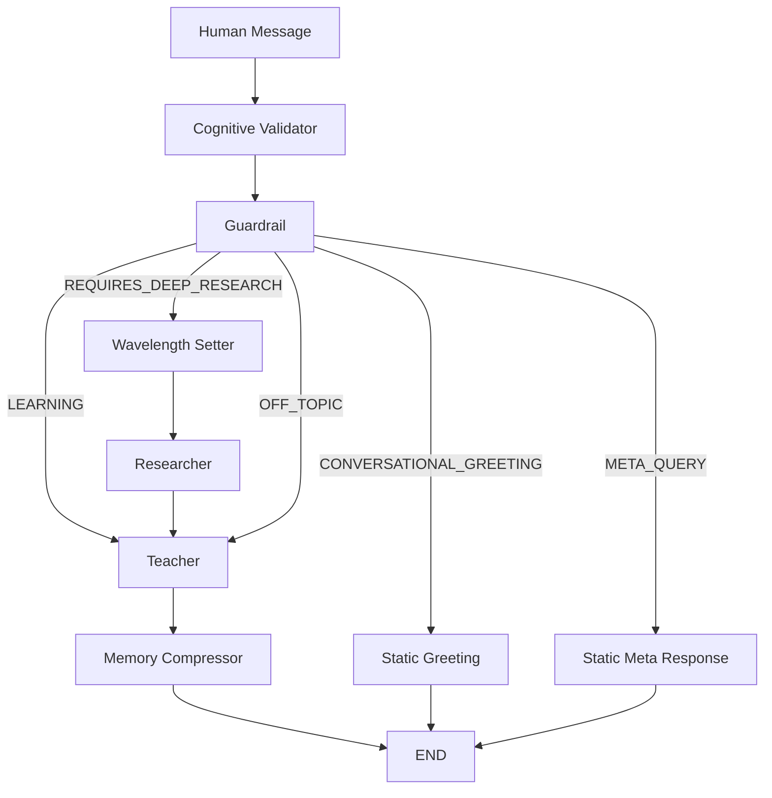

# Syntapse — Agent Architecture & Data Flow

**Last Updated:** 2026-08-10
**System Version:** v2.2 (Post‑Hardening – Full Detail)

This document provides an exhaustive description of every autonomous agent in the Syntapse system, their exact responsibilities, data contracts, trigger conditions, internal processing steps, and how they inter‑operate to deliver a seamless tutoring experience.

---

## 📚 Overview
The Syntapse platform orchestrates a **LangGraph**‑based multi‑agent graph that runs across three logical phases:
1. **Phase 0 – Calibration** – Generates a rich cognitive profile for a new user.
2. **Phase 1 – Live Chat Loop** – Handles every turn of the conversation, routing through validation, guardrails, research, and teaching.
3. **Phase 2 – Utilities & Auditing** – Performs compression, gap analysis, and housekeeping.

Each phase consists of **self‑contained agents** that communicate via typed JSON payloads. All agents are **stateless** functions; persistent state lives in FastAPI‑managed session objects and client‑side Zustand stores.

---

## 🛠️ Phase 0: Pre‑Chamber Initialization

### Agent 1 – **Cognitive Mapper**
- **File:** `backend/orchestrator.py` → `live_agent_1_mapper()`
- **Model:** Groq `llama‑3.3‑70b‑versatile`
- **Trigger:** `POST /calibrate` – user submits a **calibration essay** (minimum 300 words).
- **Input Payload:**
  ```json
  { "user_id": "string", "essay": "string" }
  ```
- **Processing Steps:**
  1. **Chunking:** Split essay into 3‑sentence windows.
  2. **Prompt Construction:** Each chunk is wrapped with `prompt_skills/cognitive_mapper_vr_holy_grail.md` which asks for **evidence‑grounded observations**.
  3. **Parallel LLM Calls** (max 4 concurrent) → returns a list of **Observation** objects.
  4. **Aggregation:** Merge observations, deduplicate by `evidence_id`.
  5. **Signature Generation:** Compute `epistemic_signature` (certainty‑score, anchor‑tokens).
  6. **Directive Synthesis:** Build `tutor_directive` containing pedagogical constraints and detected knowledge gaps.
- **Output JSON (`cognitive_profile`):**
  ```json
  {
    "cognitive_dna": {
      "evidence_ledger": [{"id": "...","text": "...","confidence": 0.92}],
      "atomic_evidence_map": {"clause": "...", "causal_chain": ["..."]},
      "epistemic_signature": {"certainty": "high", "anchors": ["..."]},
      "reverse_engineered_model": {"predicted_friction": ["..."], "compression": "0.78"},
      "tutor_directive": {"constraints": ["no‑hallucination","use‑simple‑analogy"], "detected_knowledge_gaps": ["..."]}
    }
  }
  ```
- **Persistence:** Stored in client‑side **Zustand** store (`localStorage['cognitive_profile']`) and also cached server‑side in Redis (`session:{user_id}:profile`).
- **Side‑effects:** Emits a `profile_ready` event on the WebSocket used by the frontend to enable the chat UI.

---

## 🔄 Phase 1: Live Chat Loop (LangGraph)

All agents in this phase receive a **standardised turn payload** from the FastAPI `/chat` endpoint:
```json
{
  "session_id": "string",
  "user_message": "string",
  "cognitive_profile": {...},
  "teacher_memory": [...],
  "research_catalog": [...],
  "active_cognitive_hypotheses": [...]
}
```
The graph routes this payload through the following nodes in strict order.

### Agent 3 – **Cognitive Validator**
- **File:** `backend/nodes.py` → `cognitive_validator_node()`
- **Model:** Groq `llama‑3.3‑70b‑versatile`
- **Trigger:** Every chat turn (first node).
- **Purpose:** When the Teacher asked a **Socratic probe** on the previous turn, this node evaluates the user response, emits a `CognitiveEvent` (`support`, `refute`, `neutral`) and updates the hypothesis list.
- **Logic Flow:**
  1. Detect if previous `last_teacher_probe.type` is in `{"diagnostic","pedagogical_validation"}`.
  2. If **yes**, construct a validation prompt that includes the original probe, user reply, and current `active_cognitive_hypotheses`.
  3. LLM output parsed into `event_type` and optional `evidence_score`.
  4. Update `active_cognitive_hypotheses` → remove resolved, add new if confidence > 0.8.
- **Output:** `{ "cognitive_events": [...], "active_cognitive_hypotheses": [...] }`
- **Skip Conditions:** No probe or `probe_type == 'clarification'`.

### Agent 5 – **Guardrail**
- **File:** `backend/nodes.py` → `guardrail_node()`
- **Model:** Groq `llama‑3.3‑70b‑versatile`
- **Trigger:** Runs **after** Cognitive Validator.
- **Intent Taxonomy (5‑class):**
  1. `LEARNING` – On‑topic, answerable question → forward to Teacher.
  2. `OFF_TOPIC` – Out‑of‑scope → Teacher returns a polite rejection.
  3. `REQUIRES_DEEP_RESEARCH` – Needs external facts → activate **Wavelength Setter** + **Researcher**.
  4. `CONVERSATIONAL_GREETING` – Deterministic 0‑token bypass, static greeting.
  5. `META_QUERY` – Deterministic description of system capabilities.
- **Processing:**
  - Prompt (`guardrail_vr_holy_grail.md`) receives the user message, current profile, and recent teacher output.
  - **Zero‑token bypass** for classes 4‑5 (hard‑coded responses).
  - Returns `{ "intent": "LEARNING"|..., "requires_deep_research": bool }`.
- **Output:** `intent` + `requires_deep_research` flag.

### Agent 2 – **Wavelength Setter** *(conditional)*
- **File:** `backend/nodes.py` → `wavelength_setter_node()`
- **Model:** Groq `llama‑3.3‑70b‑versatile`
- **Trigger:** Only when Guardrail signals `requires_deep_research: true`.
- **Deduplication Logic:**
  - Inspect `research_catalog.canonical_subtopics`.
  - If **≥ 2** overlapping keywords already exist for the new query, **skip** Tavily call and reuse existing sub‑topic.
- **Output:** Optimised search query object:
  ```json
  { "search_query": "...", "include_domains": ["..."], "exclude_domains": ["..."] }
  ```
- **Side‑effect:** Emits `search_prepared` event for telemetry.

### Agent 6 – **Researcher / Auto‑Librarian** *(conditional)*
- **File:** `backend/nodes.py` → `research_node()`
- **Model:** NVIDIA `meta/llama-3.1-8b-instruct` (synthesis).
- **Search Engine:** **Tavily** (3 API keys rotated via env vars).
- **Trigger:** Immediately after Wavelength Setter (or directly from Guardrail if wavelength is bypassed).
- **Steps:**
  1. **Rate‑limit**: Enforce 2 calls / minute per user (Redis token bucket).
  2. **Query Execution**: Send `search_query` to Tavily, receive up to 10 results.
  3. **Fact Extraction**: For each result, run synthesis LLM to extract **source‑supported facts** (max 5 per source).
  4. **Canonicalisation**: Deduce `canonical_subtopics` via clustering of extracted facts.
- **Output (`research_catalog` entry):**
  ```json
  {
    "search_query": "...",
    "source_url": ["https://..."],
    "source_supported_facts": [{"fact": "...","confidence": 0.94}],
    "canonical_subtopics": ["..."],
    "timestamp": "2026-08-10T09:00:00Z"
  }
  ```
- **Logging:** Debug prints include *search depth*, *allowed/blocked domains*, and *key rotation index*.

### Agent 4 – **Adaptive Cognitive Teacher**
- **File:** `backend/nodes.py` → `teacher_node()`
- **Model:** Groq `llama‑3.3‑70b‑versatile`
- **Prompt:** `prompt_skills/teacher_tutor_vr_holy_grail.md`
- **Key Behaviors:**
  1. **Ambiguity Check** – If user query matches regex `/^(explain|tell me about).*/i`, teacher returns a **clarification request** instead of a guess.
  2. **Profile Health Indicator** – Prints `✅ Full / ⚠️ Partial / ❌ No profile` on each turn for debugging.
  3. **Research Cap** – Limits context to the **most recent 3** `research_catalog` entries to avoid token overflow.
  4. **Hypothesis Pruning** – Removes resolved hypotheses (those with `support` or `refute` events) and caps at **5** active hypotheses.
  5. **Probe Depth Matching** – Determines probe type based on teacher's answer depth (basic ↔ clarification/diagnostic, pedagogical_validation ↔ intermediate/deep).
  6. **Phantom Probe Guard** – `last_teacher_probe` only recorded after a **non‑fallback** response.
  7. **Reactive Fallback** – If `requires_research_fallback: true` (e.g., low confidence), loops back to **Researcher** up to **2 attempts**.
- **Input Payload:** Combines `user_message`, `cognitive_profile`, `teacher_memory[-8:]`, `research_catalog (last 3)`, and `active_cognitive_hypotheses`.
- **Output:**
  ```json
  {
    "messages": [{"role":"assistant","content":"..."}],
    "last_teacher_probe": {"type": "diagnostic", "content": "..."},
    "last_teacher_response": "...",
    "active_cognitive_hypotheses": [...]
  }
  ```

---

## ⚙️ Phase 2: Utilities & Auditing

### Memory Compressor
- **File:** `backend/nodes.py` → `memory_compressor_node()`
- **Model:** NVIDIA `meta/llama-3.1-8b-instruct`
- **Trigger:** After every successful Teacher response.
- **Purpose:** Convert the verbose teacher reply into a compact **"Ghost Record"** JSON representation (max 200 tokens) and append to `teacher_memory`.
- **Algorithm:**
  1. Summarise the teacher message (`summarize -> key points`).
  2. Encode into a deterministic JSON schema (`{topic, key_points[], confidence}`).
  3. Keep only the **last 8** ghost records for future context.
- **Output:** Updated `teacher_memory` array (persisted in Redis session).

### Agent 3B – **Gap Analyzer**
- **File:** `backend/nodes.py` → `gap_analyzer_node()`
- **Model:** NVIDIA `meta/llama-3.1-8b-instruct`
- **Trigger:** `POST /gap_analysis` endpoint or UI "Diagnose" button.
- **Guard:** Requires at least **2 user messages**; otherwise returns `"ask more questions first"`.
- **Input Aggregation:**
  - Full `user_exploration_path` (chronological list of user utterances).
  - Last 4 `recent_chat_context` messages.
  - `teacher_memory`, `research_catalog`, `cognitive_profile`, `cognitive_events`.
- **Processing:**
  1. Compute **coverage matrix** of observed sub‑topics vs. curriculum map.
  2. Identify **missing sub‑topics** with confidence > 0.7.
  3. For each gap, generate a **button_label** (e.g., “Explore Quantum Entanglement”) and a **search_query** pre‑filled for the Researcher.
- **Output:**
  ```json
  {
    "diagnostic_summary": "You have covered basics of wave‑particle duality but missing entanglement…",
    "suggestions": [
      {"button_label": "Entanglement Deep Dive", "search_query": "quantum entanglement tutorial"},
      ...
    ]
  }
  ```

---

## 🔁 Graph Routing (LangGraph)
The full directed graph with conditional branches is visualised below. Nodes are executed in the order shown, with **early exits** for greeting/meta queries.



---

## 📡 API Endpoints (FastAPI – `backend/main.py`)
| Method | Endpoint | Purpose | Returns |
|---|---|---|---|
| `POST` | `/calibrate` | Run Agent 1 on user essay, store profile | `{profile_id, status}` |
| `DELETE` | `/calibrate` | Clear stored cognitive profile | `{deleted: true}` |
| `POST` | `/session/start` | Initialise LangGraph session state | `{session_id, token}` |
| `GET` | `/session/{id}` | Fetch session state + message history | `{session_state}` |
| `POST` | `/chat` | Execute a single turn through the multi‑agent graph | `{messages, agents_triggered, teacher_memory}` |
| `POST` | `/gap_analysis` | Trigger Agent 3B gap analysis | `{diagnostic_summary, suggestions}` |

**Note:** The `/chat` response now includes an `agents_triggered` array that lists every agent that ran for this turn – used by the frontend for telemetry and UI highlights.

---

## 🧩 Data Contracts (Key Schemas)
```json
// Cognitive Profile (stored in Redis & localStorage)
{
  "cognitive_dna": {
    "evidence_ledger": [...],
    "atomic_evidence_map": {...},
    "epistemic_signature": {...},
    "reverse_engineered_model": {...},
    "tutor_directive": {...}
  }
}

// Research Catalog entry
{
  "search_query": "...",
  "source_url": ["..."],
  "source_supported_facts": [{"fact": "...","confidence": 0.9}],
  "canonical_subtopics": ["..."],
  "timestamp": "..."
}

// Teacher Memory (Ghost Records)
[
  {"topic": "...","key_points": ["..."],"confidence": 0.87},
  ...
]
```

---

## 🚀 Operational Considerations
* **Rate Limiting** – Guardrail enforces per‑user token budgets (2 LLM calls / second, 5 Tavily searches / minute).
* **Error Handling** – Every agent returns a `{success: bool, error?: string}` envelope; the orchestrator falls back to a generic *"I’m unable to process that right now"* message.
* **Telemetry** – Each agent emits a `metrics` event (`duration_ms`, `tokens_used`). Collected by the frontend for real‑time visualisation.
* **Testing** – Unit tests for each node live under `backend/tests/` and are executed via `pytest -q`.

---

## 📚 Further Reading
* **Prompt Library** – `prompt_skills/` folder contains the exact system prompts for each agent.
* **LangGraph Docs** – https://langchain.com/langgraph
* **Tavily API Docs** – https://tavily.com/docs

---

*Prepared by Antigravity – 2026‑08‑10*
